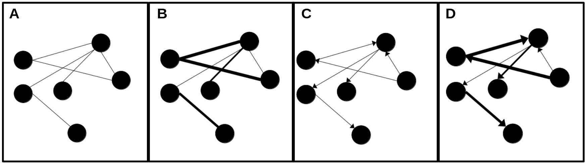
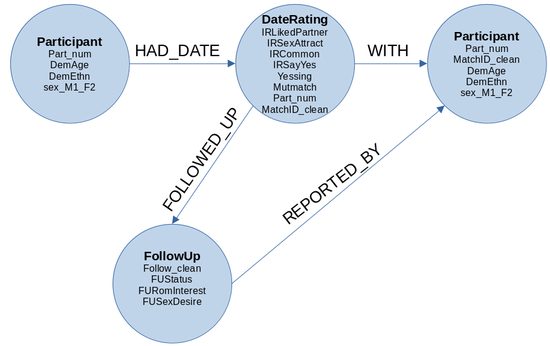
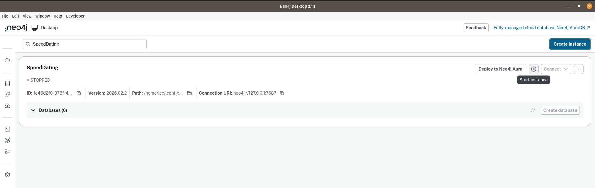
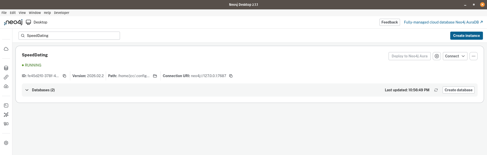
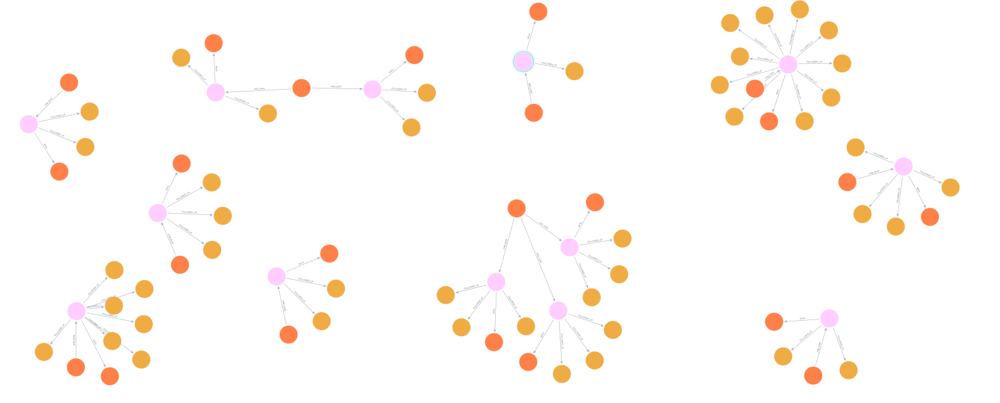

```{r setup, include=FALSE}
knitr::opts_chunk$set(echo = FALSE,
                      out.extra = "")  # This forces knitr to label all figures.
```

# Introduction {#sec1}

In a recent article, @soto2025 introduced relational databases and illustrated their use by behavioral scientists through real-world examples.
Although relational databases with their standardized "structured query language" (SQL) remain the dominant paradigm in research and industry, alternative approaches are gaining traction.
The so-called "Not Only SQL" (NoSQL) category includes database systems that employ non-tabular data models, such as key-value pairs, documents, wide columns, matrices, and graphs.
Whereas relational databases store structured data in tables (i.e., columns as variables, rows as cases, and cells containing specific values), NoSQL systems accommodate flexible formats that better support evolving and highly connected data, which provides distinct advantages in psychological research.

In this article, I examine graphs as a database paradigm that deviates from the traditional lenses of relational databases, where nodes and edges (instead of tables and joins) represent the basic elements of any behavior that can be represented as a network or a complex system.
Networks have a long history in mathematics as "*graph theory*" [@Estrada2011].
In sociology and social sciences, graph theory is known as "social network analysis" [@Wasserman1994].
In this context, the term "social network" should not be confused with Instagram or Facebook, as they are online platforms that do not necessarily represent all aspects of social networks as an object of study.
Psychologists have leveraged this framework to analyze the structure of psychopathology [@borsboom2013], conduct bibliometric analysis of cyberbehavior [@serafin2019], estimate the correct number of dimensions in psychological and educational instruments [@golino2017], or understand the measurement of organizational climate [@menezes2021].
Even though these examples show the versatility of social network analysis for psychological research, they do not rely on graph database management systems and this aspect is what differentiates this article.
Here, I intend to illustrate how the network lenses, when applied as a database management system, unveils novel ways for modeling and analyzing behavioral and psychological data.

# Graph-based databases: A gentle introduction {#sec2}

Any graph-based database relies on network basic terminology. Thus, a brief recap is useful here. @Estrada2011 defines a network as a collection of points (called nodes) joined together in pairs by lines (called arcs or edges) like those depicted in Figure [1](#fig:F1). Despite this simplistic definition, networks provide a powerful framework to model any type of system from planets in a galaxy to neurons in the nervous system [@Vazza2020].

```{r F1, echo=FALSE, fig.cap="A visual representation of four types of networks: A) non-directed unweighted network, B) non-directed weighted network, C) directed unweighted network, and D) directed weighted network.", fig.align="center", out.width="380px", fig.pos="H"}

```

In behavioral sciences, networks have been used to understand the mechanisms of team assembly and how these mechanisms determine collaboration structure and team performance [@guimera2005].
Graphs offer fundamental concepts for understanding how entities (nodes) and their relationships (edges) form interconnected data structures.
From a data management viewpoint, the analysis of these data structures requires tools that go beyond the rigid tabular constraints of relational databases.
As the concepts of graphs are thoroughly covered in introductory texts [@Newman2010], these will not be revisited here.
Instead, this article aims to illustrate how graph databases can enrich the methodological toolbox of psychological researchers and behavioral scientists, enabling analyses that embrace complexity, dynamic relationships, and multi-level contingencies [@Robinson2015].

@Robinson2015 define a graph database as a system that implements **C**reate, **R**ead, **U**pdate, and **D**elete (CRUD) operations on a graph data model, where entities are represented as nodes and relationships as edges like the one depicted in Figure [2](#fig:F2) derived from the Speed‑Dating dataset [@Selterman2023] which was a replication study from the original article by @Eastwick2008.

```{r F2, echo=FALSE, fig.cap="A visual representation of a graph database that combines persons, companies, and routes", fig.align="center", out.height="180px", out.width="350px", fig.pos="H"}

```

In contrast to relational databases (where relationships exist only implicitly through table joins) graph databases treat relationships as fundamental elements.
This design enables researchers to traverse, query, and model highly interconnected data structures with exceptional efficiency.
Figure [2](#fig:F2) shows information at three distinct levels: (1) stable participant characteristics (e.g., age, ethnicity, sex), (2) interaction‑level impressions recorded during each brief date (e.g., attraction, perceived similarity, desire to say “yes”), and (3) longitudinal follow‑up responses across subsequent weeks for pairs who continued interacting.
These layers of data are represented as interconnected components of a single, coherent graph structure.

## Entities as Nodes

`Participant` nodes represent individuals in the study and store stable demographic properties such as age, ethnicity, and sex (from the codebook variables DemAge, DemEthn, and sex_M1_F2).
`DateEvent` nodes represent each dyadic interaction and store the full set of impression‑formation ratings provided by participants during speed‑dating (e.g., IRLikedPartner, IRSexAttract, IRCommon, IRSayYes, yessing, mutmatch). These correspond directly to the interaction‑record variables in the dataset. `FollowUp` nodes represent week‑level longitudinal responses, including relationship status, romantic interest, sexual desire, and commitment indicators (e.g., FUStatus, FURomInterest, FUSexDesire, FUCommitted), captured only for participants who matched and continued interacting.

## Relationships as Edges

Edges define how these nodes are linked and encode psychological structure directly. `HAD_DATE` edges connect Participants to the DateEvents in which they took part, indicating the rater’s perspective on that interaction. `WITH` edges connect the DateEvent back to the other participant, allowing the system to explicitly represent dyadic structure. `FOLLOWED_UP` edges link `Participants` to their `FollowUp` nodes, representing relational trajectories across weeks. Optionally, a `MUTUAL_MATCH_WITH` edge can be created between two `Participants` when the `mutmatch` property equals 1, providing a direct representation of reciprocal liking (i.e., a relationship that is invisible in rectangular data but naturally expressed in graph form).

## Why This Matters for Psychological Research

This structure offers several methodological advantages. Psychological data retain their natural relational structure. Dyadic interactions are modeled as shared events rather than duplicated rows, preserving the topology of social and romantic processes as they occur in the real world. Temporal processes become navigable. `Follow‑up` nodes can be traversed sequentially, enabling queries such as ``How early do committed feelings emerge among mutually matched pairs?''
or "Does initial sexual attraction predict later romantic interest?''

In addition, missingness is handled structurally, not numerically.
Participants who did not match simply lack `follow‑up` nodes; no NA encoding is required. The model is inherently extensible.
Additional constructs, such as personality traits or behavioral logs, can be attached as new nodes or properties without reconfiguring the existing database schema.

In sum, LPGs allow behavioral scientists to represent complex, multi-level psychological phenomena in a way that relational tables cannot.
The Speed‑Dating schema makes clear how impression formation, dyadic reciprocity, and longitudinal relationship development can be captured and analyzed within a single unified model.

# Why graph databases as psychological method

Any graph database model leverages the so-called "labeled property graph." As a computational tool it paves the way for incorporating complex systems thinking in any discipline [@Krakauer2019], and as a psychological method it opens the door for interdisciplinary collaboration.
In psychology and behavioral sciences, complex systems thinking is not novel at all [@Luce1999; @Guastello2009].
However, labeled property graph models and their elements have been largely overlooked.
This gap coincides with recent reviews that promote other methodologies as potential solutions to increase intra and interdisciplinary interactions across subfields of behavior analysis in both basic and applied settings [@Elcoro2023].

As a psychological method, labeled property graph models share some similarities with the "nomological nets" coined by @cronbach1955.
However, labeled property graph models (also known as knowledge graphs) represent a more general purpose toolkit that transcends the seminal conception of nomological nets (see Table [1]()).

| Feature | Knowledge graphs | Nomological nets |
|------------------------|------------------------|------------------------|
| Primary field | Computer science / AI / Data engineering | Psychology / Philosophy of Science |
| Primary goal | Data integration, search, automated reasoning. | Establishing construct validity (i.e., proving a theory). |
| Nature of nodes | Concrete entities (e.g., "Lee J. Cronbach", "University of Illinois"). | Theoretical constructs (e.g., "introversion", "intelligence"). |
| Nature of edges | Predicate or properties (e.g., "works_at", "collaborate_with"). | Theoretical laws or empirical correlations. |
| Verification | Based on data consistency and retrieval accuracy | Based on statistical evidence (correlations and p-values) |
| Scale | Can contain billions of facts (e.g., Google knowledge graph) | Usually small, focused on a specific theoretical model |

: Knowledge graphs and nomological nets

A methodolgical implication embedded in graph databases is their performance when handling network data structures [@Robinson2015].
In relational databases, join-intensive queries slow down as datasets grow, whereas graph databases maintain relatively stable performance —even with millions of nodes and edges.
From a traditional perspective, the idea of working with huge datasets might seem implausible for most psychological researchers.
Nonetheless, big data research is no longer outside professional considerations and that explains why big data has been recently reviewed as a psychological method [@vezzoli2023].
For example, previous works in network science has shown how to address complex behavioral phenomena such as the analysis of urban traffic at an individual level by tracking the movements of hundreds of thousands of drivers every two hours [@Gonzalez2008].
In cases like this, graph databases excel because queries operate on localized portions of the graph rather than scanning the entire dataset.
If edges store information such as commuting distances, queries can be designed to retrieve specific conditions (e.g., individuals who commute less than 10 miles versus persons who commute more than 20 miles). Consequently, execution time depends only on the size of the subgraph traversed, not the overall graph size.

Another implication of graph databases is their flexibility.
Behavioral scientists aim to connect data in ways that reflect their knowledge and expertise.
This is why graph databases serve as the underlying infrastructure for constructing "knowledge graphs" [@Barrasa2023].
With these knowledge graphs, researchers allow the database to evolve alongside their understanding of the behavioral phenomenon rather than being rigidly defined upfront, when knowledge is most limited.
This is particularly important when a behavioral phenomenon lacks theoretical background or lacks replication [@burgos2025].
Graph databases fulfill this need by providing a flexible model that adapts to changing requirements and evidence.
Because graphs are inherently additive, new nodes, relationships, labels, and subgraphs can be introduced.
The modifications introduced to the original graph do not imply a threat to existing queries or application functionality.
This flexibility minimizes the need for exhaustive upfront modeling and lowers the frequency of costly migrations (particularly for companies that hire behavior data scientists in charge of analyzing customers observed behavior), thereby reducing maintenance overhead in both academic and business settings.

A third implication of graph databases is the agility that they offer.
Modern graph databases enable smooth development and easy system maintenance.
Their schema-free design, combined with testable APIs and query languages, allows controlled evolution of applications.
While the absence of rigid schemas means traditional governance mechanisms are missing, this is not a drawback.
On the contrary, it encourages more transparent and actionable data governance.
Typically, governance is enforced programmatically through tests that validate data models, queries, and business rules.
This approach aligns well with agile and test-driven development practices, making graph database applications adaptable to changing business needs.
In psychology, these aspects can be vital for the so-called "automated data collection techniques." For example, mobile applications, such as ecological momentary assessment tools, prompt users to report emotions or behaviors throughout the day, while motion sensors and radio frequency identification tags can monitor movement and location in homes or classrooms [@Bak2021].

It is worth mentioning that relational databases acknowledge relationships, but only during modeling, where they serve as join mechanisms between tables.
In graph databases, we often need to clarify the meaning of relationships and even qualify their strength.
These are aspects that relational database management systems do not address explicitly [@Robinson2015].
From this viewpoint, graph databases demand both ontological and epistemological considerations like the ones recently described in the literature of theoretical and philosophical psychology [@burgos2025].
Roughly speaking, ontological considerations relate to traditional questions of pure ontology like what is it to be?
what does exist?
What is the nature of what exist?
In contrast, epistemological considerations pertains matters of evidence, explanation, certainty and truth [@burgos2025].
As datasets grow more complex and less uniform (provided new evidence is available), relational data management systems like Microsoft Access, PostgreSQL, or SQLite become burdened with large join tables, sparsely populated rows, and extensive null-checking logic.
Greater interconnectedness in relational databases leads to more joins, which degrade performance and complicate adaptation to evolving requirements.
@soto2025 has highlighted some of these limitations as "challenges to adoption." From the lenses of graph databases, however, these challenges are not even necessary.
I will elaborate upon this particular aspect in the next section.
As a wrap-up, labeled property graphs are not merely a technical alternative to relational schemas; they represent a methodological advance that aligns with psychology’s need for flexible, scalable, and conceptually transparent data models.

# Applying graph database in behavioral research

To illustrate the application of graph databases for behavioral scientists, I revisit the Speed‑Dating dataset [@Selterman2023] which provides a replication study from the seminal article by @Eastwick2008. The general description of this replication study is available in an [OSF repository](https://osf.io/ng6cc/overview). This repo provides access to the ``speed.dating.2.zip'' file which contains the raw data in an SPSS data format (.sav). This file can be easily read in SPSS, PSPP, Jasp, Jamovi, or RStudio.
Given the wide variety of graph database management systems in the market (e.g., Neo4j, Microsoft Azure Cosmos, Aerospike, Amazon Web Services Neptune, NebulaGraph, Memgraph, TigerGraph, Giraph), the rest of this work relies on Neo4j [@Barrasa2023].

Neo4j ranks as a leading freemium software for graph database management systems and has been used in several industry sectors including retail, finance, pharmaceutics, hospitality, and electronic commerce, among others.
Neo4j offers free and enterprise editions, which can be installed on local or server environments following official documentation.
As the official documentation provides helpful material for newcomers, downloading and installation details are not necessary here, and the reader can consult specific details elsewhere [@vanBruggen2014].

## Prerrequisites and materials

the Speed‑Dating dataset [@Selterman2023] which was a replication study from the original article by @Eastwick2008.

## STEP 1: Instance creation and data import

Instance creation is the first step in using graph databases with Neo4j.
This is a top-level operation for setting up a new database environment, and involves allocating resources (memory, CPU, storage), defining a database version, and setting up initial user credentials by clicking one button.
When creating a new instance, neo4j asks the user to provide a name as part of the instance details.
The user is asked to provide a password of eight characters as a security check for further interactions.
The instance created is called "OFD," an acronym for "Online Food Delivery," and computational details can be found in our public GitHub repository.
By default any instance created in neo4j is in "stopped" mode so the user needs to start it by clicking one button.
The data import is straightforward using the import option depicted with a red circle in the left panel of neo4j (see Figure [3](#fig:F3)).

```{r F3, echo=FALSE, fig.cap="The drag-and-drop import files option in the left panel of neo4j", fig.align="center", out.height="180px", out.height="200px", out.width="380px", fig.pos="H"}

```

As described above, the database is a CSV file (newdata.csv) containing 19 variables.
Delivery time fulfillment is recorded in seconds or minutes (in the last two columns of the dataset).
According to @segura2019, this database was developed to evaluate the impact of traffic conditions on key performance indicators for a sample of restaurants offering food delivery services in Bogotá.
It includes the physical locations of both restaurants and customers, as well as performance metrics and traffic data captured by the Google Maps API at three time points during Saturday rush hours.

## STEP 2: Understanding the context

Traffic conditions in cities like Bogotá promote food delivery services as an alternative to cooking or driving to get food [@correa2019a].
As Bogotá has long suffered traffic congestion problems, local governmental authorities have decided to impose a restriction program called "Pico y Placa" [@montero2025].
This program was introduced in August 1998 and has been modified several times looking to extend its scope.
For example, since July 2012, Pico y Placa affects the half of residential and commercial vehicles every other day of the week (excluding weekends) from 6:00 to 8:30 a.m.
and then from 3:00 to 7:30 p.m, and buses, police cars, ambulances, fire trucks, government and diplomatic vehicles, school buses and vans, and electric and hybrid vehicles are exempt.
To decide which half of the fleet is restricted in any given day, the Pico y Placa follows an odd–even schedule based on the last digit of the vehicle’s license plate [@montero2025].

In this context, @correa2019a reported that the data collected from Google Maps API indicated that rush hours occur three times during Saturdays: in the morning (between 8:00 and 10:00 a.m); around midday (between 12:00 and 2:00 p.m); and in the evenings (between 6:00 and 8:00 p.m).
Based on this information, @correa2019a classified the typical traffic in three categories: "free" or "green traffic" (G), "average" or "orange traffic" (O), and "heavy" or "red traffic" (R).
By using letter triads they characterized the typical daily traffic with sequences like "G-G-G" or "R-O-R." Thus, for example, the sequence “R-O-G” means that the typical traffic changes from “red” in the morning to “orange” at noon and “green” in the afternoon, describing a place where traffic conditions improve as time passes.

## Sketching a graph database model

Sketching a graph database model is the next step after a successful data import in Neo4j.
Given the benefits of the labeled property graph, an initial model can be modified multiple times.
These modifications are important because they reflect the analyst’s expertise and highlight critical nodes and relationships to be mapped.
An initial graph database model can consider the most elementary schema focused on the relationship between restaurants and customers (Figure [4](#fig:F4)).

```{r F4, echo=FALSE, fig.cap="A visual representation of the initial schema about restaurants-customers relationship", fig.align="center", out.height="180px", out.height="90px", out.width="380px", fig.pos="H"}

```

In this graph model, the node "`Restaurant`" has four hidden properties (i.e., web, name, latitude, and longitude), the node "`Customer`" has two hidden properties (i.e., ClientLatitude, ClientLongitude), and the relationship "`SERVES`" has one property (i.e., distance).
Despite its simple visual representation, with this model we can examine several statistical aspects.
For example, by using cypher (i.e., the declarative, SQL-like query language for property graphs in Neo4j) the following syntax provides the minimum, the mean, and the maximum distance coverage from restaurants to customers' location.

```         
MATCH (:Restaurant)-[s:SERVES]->(:Customer)
RETURN round(avg(toFloat(s.Distance)), 1) AS avgDistanceMts,
       min(toFloat(s.Distance))           AS minDistanceMts,
       max(toFloat(s.Distance))           AS maxDistanceMts;
```

Despite the simplistic structure of the graph database model of Figure [4](#fig:F4), its complexity and scope can easily grow as long as the analyst intends to map other variable relationships.
Before moving on how to increase the complexity of this graph database model, it is worth mentioning that it opens the possibility to examine the `Restaurant-SERVES-Customer` resulting network with a single cypher query like this one:

```         
// Show the Restaurant–Customer network for distance <= 2000 meters
MATCH (r:Restaurant)-[s:SERVES]->(c:Customer)
WHERE toFloat(s.Distance) <= 2000
RETURN r, s, c;
```

With this cypher query, Neo4j produces a network visualization that shows the graph data structure like the one depicted in Figure [5](#fig:F5).
Such a network-based data structure visualization unlocks further analyses via Neo4j's built-in plugin called "Graph Data Science" (GDS).
This plugin provides extensive analytical capabilities centered around graph algorithms, including nodes community detection, centrality, similarity, path finding, and node embeddings, as well as graph catalog procedures and machine learning pipelines designed to support data science workflows for graphs.
With GDS, all operations are designed for massive scale and parallelization, with a custom and general API tailored for graph-global processing, and highly optimized compressed in-memory data structures.

```{r F5, echo=FALSE, fig.cap="A network-based visualization of the Restaurant-SERVES-Customer graph model", fig.align="center", out.width="250px", out.height="280px", out.width="380px", fig.pos="H"}

```

From a methodological viewpoint, examining network-based data enables the identification and testing of confounding factors in behavioral non-experimental research designs.
According to @Kerlinger1986, a confounding factor (or hidden variable) refers to the mixing of the statistical variance of one or more independent variables—typically extraneous to the research purpose—with the independent variable or variables of the research problem.
For example, figure [5](#fig:F5) shows that the number of connections between restaurants (green nodes) and customers (pink nodes) is uneven when considering distances less than or equal to 2,000 meters (i.e., some restaurants have more clients than others).
If this pattern holds for other distances, it is appropriate to analyze the restaurant-customer relationships in the entire network.
If this pattern does not hold, then we can assume that restaurants' delivery time fulfillment might be non-linearly related to the distance between restaurant and customer locations.
Non-linear relationships in network-like data structures arise because connections between nodes follow a scale-free, power-law distribution [@barabasi1999].

The considerations described above entail further implications.
As many networks exhibit a power-law distribution—where the probability of finding a highly connected node is relatively low compared to the high probability of finding nodes with few connections—the development of large networks is governed by "self-organization" which transcends the properties of individual nodes and is therefore intrinsically linked to the network structure.
Self-organization is widely recognized in natural sciences such as physics or biology, but in psychology is not a mainstream framework [@correa2020].
Rougly speaking, emergence refers to a property of the system that is not present by the individual parts that belong to the system.
The popular phrase "the whole is greater than the sum of its parts" captures the idea of emergence, which in psychology is largely attributed to the Gestalt school of thought, but has been applied in ecological psychology [@Mace1977] and information processing in cognitive psychology [@Hollis2009].

# Why complexity matters in psychology

As previously noted, labeled property graphs are highly adaptable to new evidence.
This flexibility allows the database model to evolve through the addition of nodes and edges.
When a labeled property graph grows, it does more than just increasing its structural complexity because it mirrors the researcher’s awareness of potential confounders such as "omitted variables" whose absence might otherwise bias the rigor of subsequent statistical analyses.
In causal modeling, omitted variable bias is a primary driver of "endogeneity" [@antonakis2010].
Formally, endogeneity occurs when an independent variable ($x$) is correlated with the error term ($\epsilon$) in a regression equation ($y = \alpha + \beta x + \epsilon$).
Beyond omitted variables, endogeneity also arises from "simultaneity" or reverse causality (when $x$ causes $y$ and $y$ causes $x$) and measurement error.

While psychometric indices like McDonald’s $\Omega$ or Cronbach’s $\alpha$ help estimate measurement precision, simultaneity remains challenging in psychological research.
As these problems are present in other technical domains such as structural equation modeling [@bollen2002], they still remain as a valid concern in recent approaches [@bollen2019].
From a technical viewpoint, several reasons may explain why researchers omit one or more variables in a model.
In some cases, operational costs for capturing or measuring variables can work as barriers.
However, the impossibility to observe or measure variables has not prevented scientists to advance their knowledge in disciplines like quantum physics or theoretical biology, where mathematical modeling and computer simulations are used as scientific tools for building theories [@Luce1999].
I elaborate upon these and other implications with the same dataset described above and increase the complexity of the initial graph database by adding a third node and a second edge (see Figure [6](#fig:F6)).

```{r F6, echo=FALSE, fig.cap="The schema visualization for the Restaurant-FULFILLED-Order-TO-Customer model", fig.align="center", out.width="250px", out.height="100px", out.width="380px", fig.pos="H"}

```

Compared with the previous model, the schema of Figure [6](#fig:F6) mirrors a slightly complex version.
This complexity might not be visible in the visualization, but it is in the cypher query below.

```         
CREATE CONSTRAINT restaurant_web_unique IF NOT EXISTS
FOR (r:Restaurant) REQUIRE r.web IS UNIQUE;

CREATE CONSTRAINT customer_geo_unique IF NOT EXISTS
FOR (c:Customer) REQUIRE (c.ClientLatitude, c.ClientLongitude) IS UNIQUE;

CREATE CONSTRAINT order_number_unique IF NOT EXISTS
FOR (o:Order) REQUIRE o.number IS UNIQUE;

MERGE (r:Restaurant {web: $web})
  ON CREATE SET r.name = $name, 
  r.location = point({longitude: toFloat($Longitude), 
  latitude: toFloat($Latitude)});
MERGE (c:Customer {ClientLatitude: toFloat($ClientLatitude), 
ClientLongitude: toFloat($ClientLongitude)})
  ON CREATE SET c.location = point({longitude: toFloat($ClientLongitude), 
  latitude: toFloat($ClientLatitude)});
MERGE (o:Order {number: toInteger($number)})
SET o.Moment = $Moment,
    o.Distance_mts = toFloat($Distancemts),
    o.Time_sec = toFloat($Timesec),
    o.Time_min = toFloat($Timemin),
    o.ExpectedDeliveryTime = toFloat($ExpectedDeliveryTime),
    o.CostDelivery = toFloat($CostDelivery),
    o.MinimumChargeOrdering = toFloat($MinimumChargeOrdering),
    o.NumComments = toInteger($NumberOfComments);
MERGE (r)-[:FULFILLED]->(o)
MERGE (o)-[:TO]->(c);

MATCH (r:Restaurant), (o:Order), (c:Customer)
WITH r, o, c
MERGE (r)-[:FULFILLED]->(o)
MERGE (o)-[:TO]->(c)

CALL db.schema.visualization();
```

Now, the cypher query encodes complexity through an additional node (i.e., Order).
This node introduces a couple of edges (i.e., `FULFILLS` and `TO`) between the `Restaurant` and the `Customer`.
In addition, the `Restaurant` has three properties: web, name, and a location (that has a latitude and longitude), the `Customer` has two properties (the latitude and longitude), and the `Order` has the following properties: number, moment, distance (in meters), time (in seconds), time (in minutes), expected delivery time, delivery cost, minimum charge ordering, and number of comments.
Note that some properties are set as integers and others as float.
This distinction is also important from an interdisciplinary viewpoint.
In psychology and social sciences, @stevens1946 introduced a classic distinction of variables that dominates several introductory textbooks on statistics (i.e., nominal, ordinal, interval, and ratio), but this distinction is fairly distinct from the computational viewpoint (i.e., boolean, character, integer, and float) in dominating programming languages such as R or Python, which also have useful libraries that connect with Neo4j [@Godard2024; @Scifo2023].

The analytical power of labeled property graphs such as those created in Neo4j resides in the property-rich event nodes and constraints that permit temporal slicing, spatial querying, and graph data science workflows.
In our case, modeling `Order` as a node (rather than just a property on a relationship) is a best practice for "analytical power" for at least two reasons.
First, it creates the possibility to connect to other nodes (i.e., `Restaurant` and `Customer`).
The node `Order` can be enriched with more information or metadata (timestamps, amounts, restaurant category) allowing "multi-dimensional" filtering without complex joins.
These filters, however, should not be confused with other sophisticated graph-based analyses focused on nodes similarity, community, and link prediction which are impossible or brittle with a single `SERVES` edge.
The distinction between diagrammatic simplicity and code-level complexity is essential in psychological data modeling, where omitted variables and contextual contingencies often drive observed outcomes.

Vamos a ver

\backmatter
